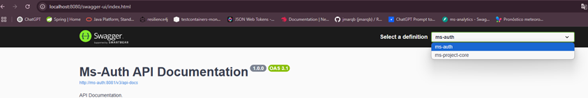
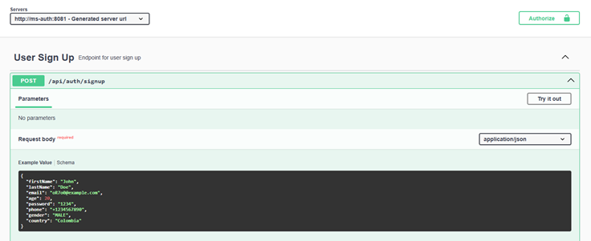
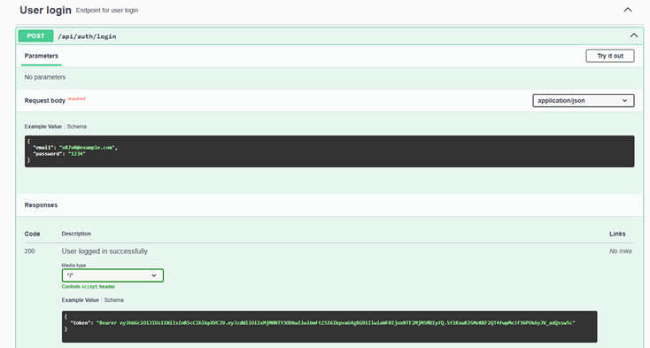
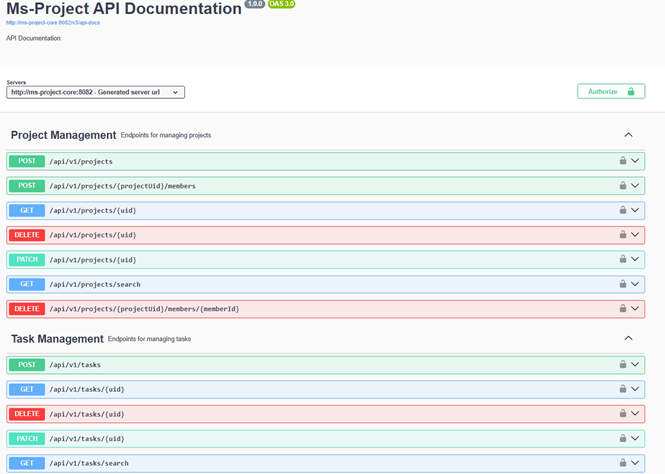

# TASKS MANAGEMENT SYSTEM

## Table of Contents:

1. [General Info](#general-info)
2. [Authentication Flow](#authentication-flow)
3. [Technologies](#technologies)
4. [Prerequisites](#prerequisites)
5. [Installation and Running](#installation-and-running---docker)
6. [Test](#test)
7. [API Documentation](#api-documentation)
8. [Contact](#contact)

## General Info

Task Management System is a project built using a microservices architecture, implemented with Spring 6 and Spring Boot
3.4.2, following a modular Spring-based structure. The application includes a configuration server, responsible for
managing and distributing external configuration files across all microservices.

The system’s security relies on a JWT-based authentication strategy, which ensures secure communication between services
and client access. This led to the creation of the following key components:

- **ms-auth**: A core authentication and authorization microservice responsible for user and role management, as well as
  generating and validating JWT tokens. It acts as the central authority for identity and access control.
- **ms-project-core**: A microservice in charge of project and task management. It handles all domain logic related to
  creating, updating, and assigning tasks within projects.
- **api-gateway**: Acts as the unified entry point for client requests, routing traffic to the appropriate microservice.
  It also plays a key role in token verification and request forwarding.

### Authentication Flow

The authentication flow is structured as follows:

1. A client sends login credentials to the `ms-auth` service.
2. Upon successful authentication, `ms-auth` generates a JWT token signed using a shared `JWT_SECRET`.
3. This token is included in each client request to access protected resources.
4. The `api-gateway` and downstream services such as `ms-project-core` use the shared `JWT_SECRET` to validate the
   integrity and authenticity of the token.
5. Valid tokens allow access to the requested endpoints; otherwise, the request is rejected.

This design emulates a scalable and secure microservices environment where identity management is centralized, and all
services share a consistent authentication strategy.

## Technologies

A list of technologies used within the project:

- **Spring Framework 6 and Spring Boot 3.4.2**: Frameworks for building Java applications quickly and efficiently with
  support for microservices architecture.
- **Spring Security**: Provides comprehensive security services, including authentication and authorization, enabling
  the JWT-based security strategy for the project.
- **Spring Data JPA**: For data persistence using the Java Persistence API (JPA) to interact with relational databases
  such as PostgreSQL.
- **Spring Cloud**: Used for the configuration server, enabling centralized configuration management across
  microservices in the system.
- **MapStruct**: A tool for mapping between DTOs (Data Transfer Objects) and entities to reduce boilerplate code and
  improve performance.
- **H2 Database**: An in-memory database used for testing purposes to simulate production-like environments in local
  setups.
- **PostgreSQL**: A relational database used for storing persistent data in the production environment.
- **SpringDoc OpenAPI**: Automatically generates OpenAPI specifications and API documentation from code annotations.
- **JUnit and Mockito**: JUnit for unit testing, and Mockito for mocking dependencies to test components in isolation.
- **Instancio**: A framework for generating random objects during testing to simplify test setup.
- **OpenFeign**: A declarative HTTP client that simplifies integration with external microservices by reducing
  boilerplate code.

## Prerequisites

***
Before you begin, ensure you have met the following prerequisites:

* JDK 21 or higher installed.
* Maven 3.6+ installed.
* Docker and Docker Compose installed.
* **Spring Boot 3.4.2** must be used for compatibility. (update the version in `pom.xml`)

## Installation and Running - Docker

First, clone the
repository and navigate to the project directory:
To run the application using Docker:

```bash
git clone https://github.com/jmarqb/task_management_system.git
cd task_management_system
mvn clean install
```

## Setup Notes (Windows/Linux)

After cloning the project, make sure Git applies the correct line endings, especially if you're on Windows.

Run this command to normalize line endings based on the `.gitattributes` configuration:

```bash
git add --renormalize .
```

**Build and run with Docker**:

- **Modify the hosts file (if you're on Windows) with administrator privileges**: Before running docker-compose, you may
  need to modify the hosts file to ensure the application can resolve the names of the containers properly.

- Open the hosts file (Windows): `C:\Windows\System32\drivers\etc\hosts`
- Add the following line at the end of the file:
  `127.0.0.1 ms-auth`
  `127.0.0.1 ms-project-core`
  `127.0.0.1 api-gateway`

- To build the Docker image and start the application, use the following command:

```bash
docker-compose up --build
```

This will set up and start both the application and necessary services like the database.

Once the containers are running, open your browser and navigate to http://localhost:8080/swagger-ui/index.html ,this
will take you to the API documentation page, where you can explore the endpoints and their usage.

**Stop the containers**:
To stop the running containers, use:

```bash
docker-compose down
```

## Test

To ensure everything runs smoothly, this project includes both Unit and Integration tests using the tools JUnit and
Mockito.
To execute them, follow these steps:

Dependency Installation: Before running the tests, ensure you've installed all the project dependencies. If you haven't
done so yet, you can install them by executing the command `mvn clean install`.

To run the tests on controllers and services, and verify the complete flow and functioning of the application use the
following command:

```bash
$ mvn test
```

It's important to highlight that these e2e tests utilize a H2 database for testing.

## API Documentation

You can access the API documentation at `localhost:8080/swagger-ui/index.html`.

### Swagger UI - Main Page


*Main landing page of the Swagger UI, listing all available microservices and endpoints.*

### User Signup Endpoint


*Example of the user registration endpoint where new users can be created.*

### User Login Endpoint


*Login endpoint for user authentication and JWT token generation.*

### Ms-Project-Core Endpoints


*Endpoints exposed by the project and task management service.*

For more detailed information about the endpoints, responses, and status codes, visit the API documentation.

---

## Contact

Thank you for checking out my project! If you have any questions, feedback, or just want to connect, here's where you
can find me:

**GitHub**: [jmarqb](https://github.com/jmarqb)

Feel free to [open an issue](https://github.com/jmarqb/task_management_system/issues) or submit a PR if you find any bugs or have some
suggestions for improvements.

© 2025 Jacmel Márquez. All rights reserved.